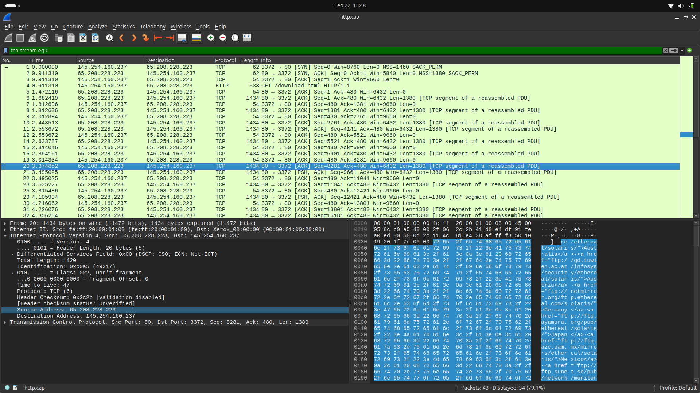
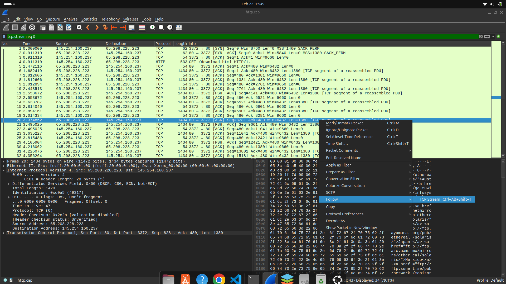
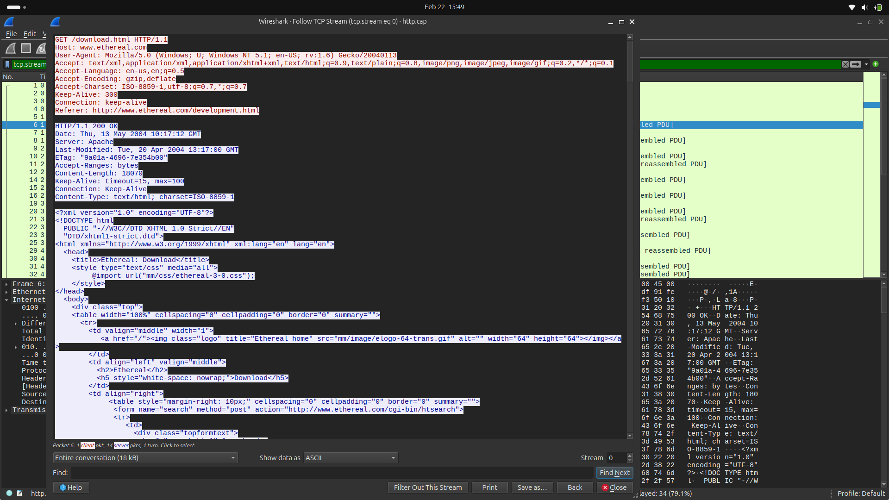
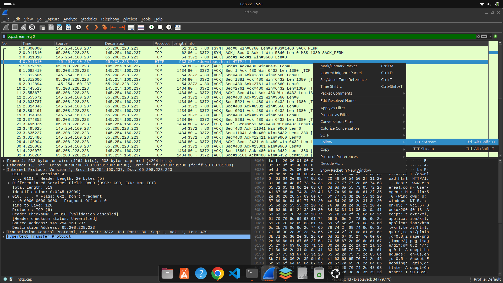
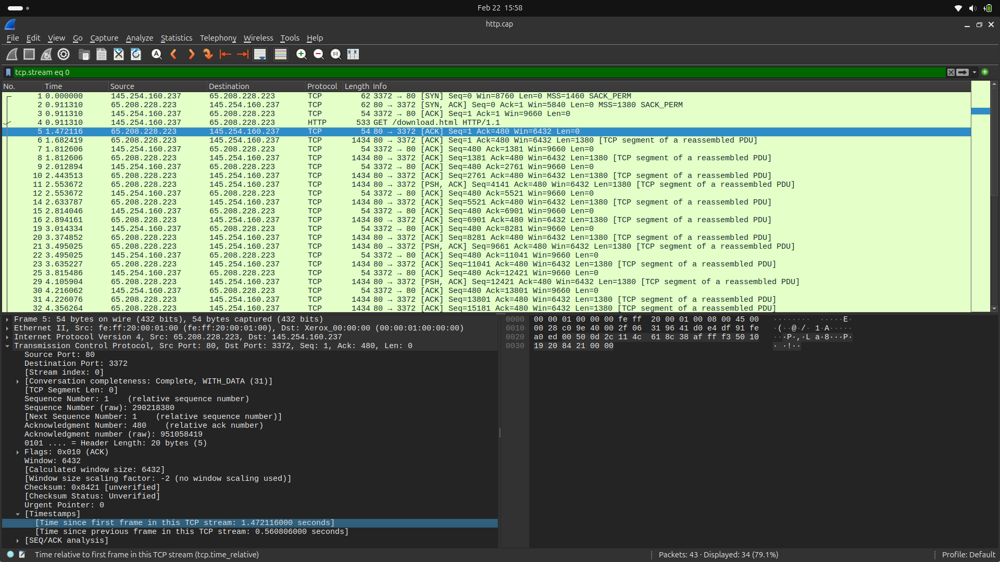
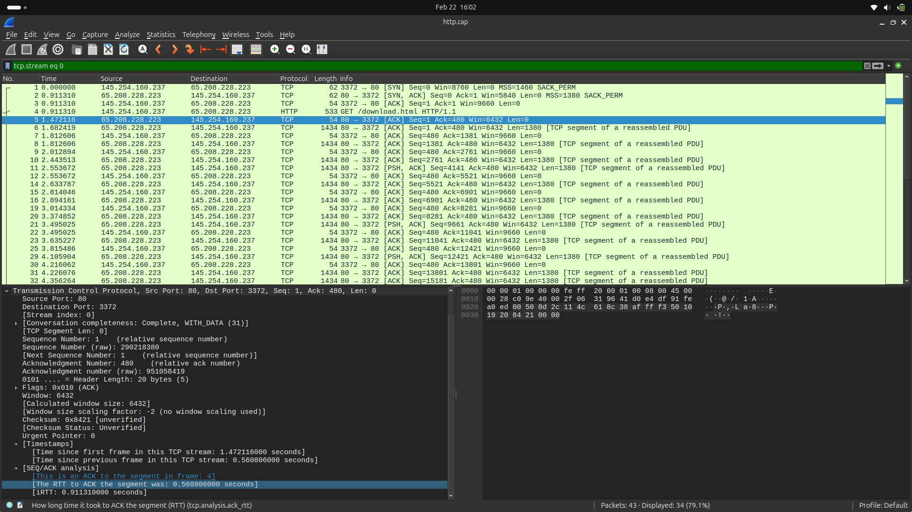
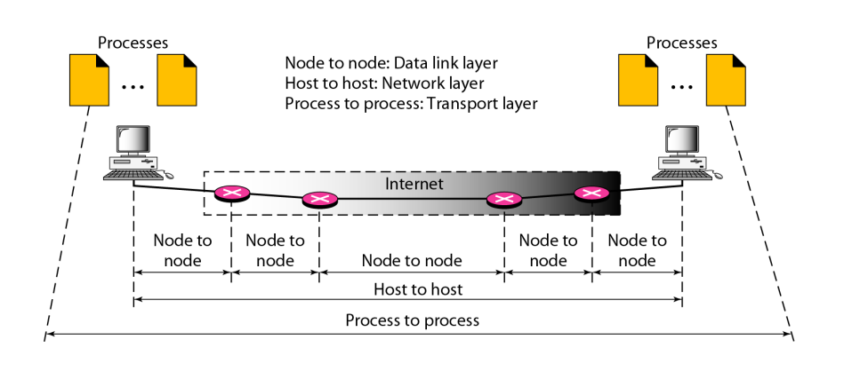

# Laporan Percobaan

## Mata Kuliah: Workshop Administrasi Jaringan

### Nama Dosen Pengampu
**Bapak Dr. Ferry Astika Saputra ST, M.Sc**

### Dikerjakan oleh:
- **Nama:** Muhammad Rafi Rizaldi  
- **NRP:** 3123600001  
- **Kelas:** 2 D4 IT A  

---

## 1. Review

### a. IP Server dan Client

Pilih salah satu paket, kemudian buka detail dari paket tersebut. Pilih **Internet Protocol Version**. Terdapat informasi **Source Address** dan **Destination Address**.

- **IP Server:** `65.208.228.223`
- **IP Client:** `145.254.160.237`

### b. Versi HTTP

Pilih salah satu paket, kemudian pilih opsi **Follow** > **HTTP Stream**.

- **HTTP Version:** `1.1`
### c. Waktu Client Mengirim Request

Pilih paket client yang mengirim HTTP request, kemudian lihat kolom **Time**.

- **Waktu:** `0.911310`

### d. Waktu Server Menerima HTTP Request dari Client

Cari acknowledge dari HTTP request client, kemudian lihat kolom **Time** pada paket 5.

- **Waktu Respon Server:** `1.472116`

### e. Waktu yang Dibutuhkan untuk Transfer dan Response dari Client ke Server

Buka **TCP Header**, kemudian lihat bagian **SEQ/ACK Analysis** untuk melihat **RTT**.

- **RTT:** `0.560806000`

---

## 2. Analisis Gambar

### 1. Node to Node: Data Link Layer
- Node adalah perangkat dalam jaringan seperti komputer, switch, atau router.
- Data Link Layer bertanggung jawab atas komunikasi langsung antara dua node dalam jaringan yang sama.
- Alamat MAC digunakan untuk mengidentifikasi perangkat dalam jaringan lokal.

### 2. Host to Host: Network Layer
- Host adalah perangkat dengan alamat IP, seperti komputer atau server.
- Network Layer mengatur komunikasi antar-host bahkan jika berada di jaringan berbeda.
- Protokol umum: ICMP dan IGMP.

### 3. Process to Process: Transport Layer
- Process merujuk pada aplikasi atau layanan yang berjalan di host.
- Transport Layer mengatur komunikasi antara proses yang berjalan di host yang sama atau berbeda.
- Protokol utama: TCP dan UDP.

---

## 3. Resume

### a. Establishing Connection (Pembentukan Koneksi)
Sebelum data dikirim, perangkat membangun koneksi TCP melalui **3-Way Handshake**:

1. **SYN (Synchronize):** Klien mengirim paket SYN ke server untuk meminta koneksi.
2. **SYN-ACK (Synchronize-Acknowledge):** Server merespons dengan SYN-ACK.
3. **ACK (Acknowledge):** Klien mengirim ACK untuk mengonfirmasi koneksi.

### b. Data Transfer (Pengiriman Data)
Setelah koneksi berhasil dibuat:

1. **Pengiriman Data:** Klien atau server mengirim data dalam bentuk segmen TCP.
2. **Acknowledgment:** Penerima mengirim ACK untuk memastikan data telah diterima.
3. **Flow Control:** TCP mencegah pengiriman data berlebihan.
4. **Error Detection:** TCP menggunakan checksum untuk mendeteksi kesalahan data.

### c. Connection Termination (Mengakhiri Koneksi)
Setelah pertukaran data selesai, koneksi TCP ditutup dengan **4-Way Handshake**:

1. **FIN (Finish) dari Klien:** Klien mengirim FIN ke server.
2. **ACK (Acknowledge) dari Server:** Server mengonfirmasi FIN.
3. **FIN (Finish) dari Server:** Server mengirim FIN ke klien.
4. **ACK (Acknowledge) dari Klien:** Klien mengonfirmasi FIN dari server.

---

**Catatan:** Gantilah placeholder gambar (`./images/...`) dengan gambar asli Anda nanti.
